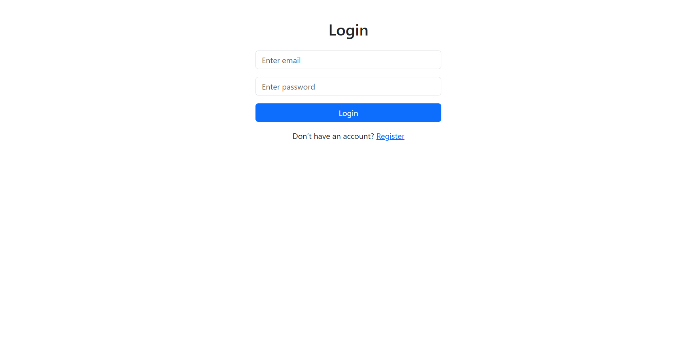
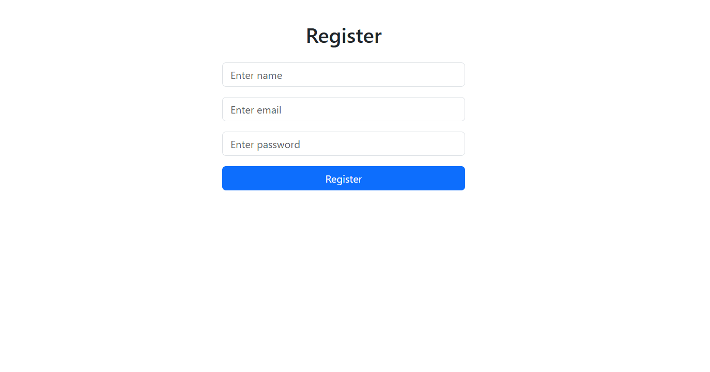
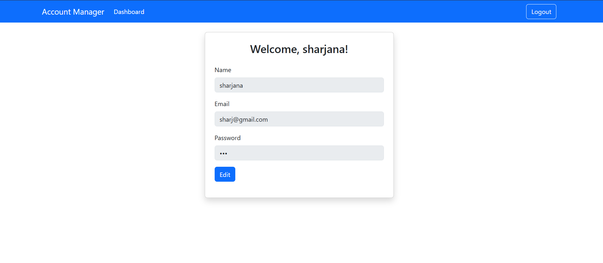
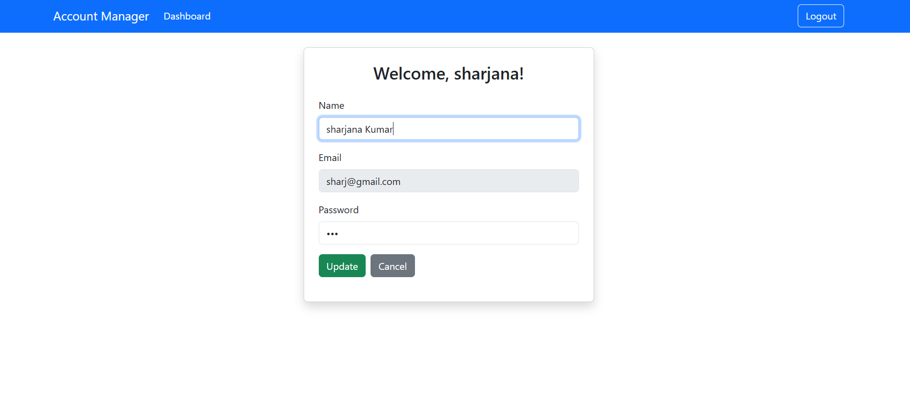
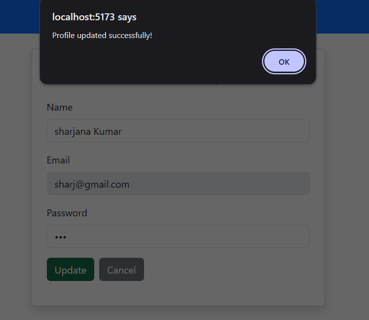

# Account Manager

A simple React application to register, login, and manage user accounts. Users can view and update their profile information on a dashboard.

## Features

- User Registration
- Login
- Dashboard with profile info (Name, Email, Password)
- Edit and Update profile details
- Logout
- Persistent data using `localStorage`
- Bootstrap styling

## Technologies Used

- React (V16+)
- React Router DOM
- Bootstrap 5
- localStorage for data persistence

## Folder Structure

account-app/
├─ src/
│ ├─ pages/
│ │ ├─ Login.jsx
│ │ ├─ Register.jsx
│ │ └─ Dashboard.jsx
│ ├─ App.jsx
│ └─ main.jsx
├─ index.html
├─ package.json
├─ README.md
└─ ...

## How to Run

1. Clone the repository:
   ```bash
   git clone https://github.com/apurv-anand-dev/account-app.git

2. Navigate to the project folder:

cd account-app


3. Install dependencies:

npm install


4. Start the development server:

npm run dev

5. Open your browser at http://localhost:5173

# Screenshots

**Login Page**



**Register Page**



**Dashboard**








